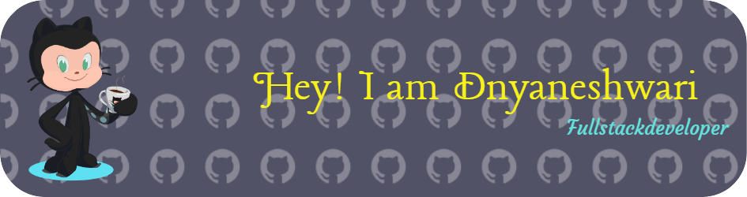

<h1 align="center">Hi 👋, I'm Dnyaneshwari Patale</h1>
<h3 align="center">A passionate full stack developer from India</h3>

  

  

- 🌱 I’m currently learning **Data Science 👩🏻‍🔬 & Wordpress**

- 👯 I’m looking to collaborate on **Open-source projects and any opportunity to create impactful software.💡**

- 🔭 Currently working on **Building innovative web applications and exploring the latest in JavaScript frameworks.**

- 👨‍💻 All of my projects are available at [https://dnyaneshwaripatalee.github.io/ItsDnyaneshwari/](https://dnyaneshwaripatalee.github.io/ItsDnyaneshwari/)

- 💬 Ask me about **Programming 👩🏻‍💻**

- 📫 How to reach me **dnyaneshwaripatale14@gmail.com**

- 📄 Know about my experiences [https://drive.google.com/file/d/1jcKwLqO_-Dkk5Rio3lWgHir3tQB_4Klb/view?usp=drivesdk](https://drive.google.com/file/d/1jcKwLqO_-Dkk5Rio3lWgHir3tQB_4Klb/view?usp=drivesdk)

- ⚡ Fun fact **like watching cartoons 🙊**

<h3 align="left">Connect with me:</h3>

<h3 align="left">Languages and Tools:</h3>

                         

&nbsp;

